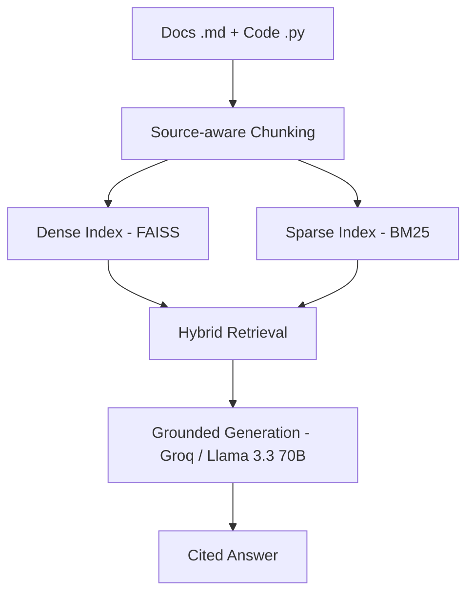

<div align="center">

# 🔎 Engineering Intelligence Hub

**Ask plain-English questions about your codebase and docs — get answers grounded in, and cited back to, the actual source.**


</div>

---

A retrieval-augmented generation (RAG) system that lets engineers ask
plain-English questions about a codebase and its documentation, and get
answers grounded in — and cited back to — the actual source files, instead
of hallucinated guesses.

## Table of contents

- [Problem statement](#problem-statement)
- [Features](#features)
- [Architecture](#architecture)
- [Why hybrid search](#why-hybrid-search)
- [Project structure](#project-structure)
- [Setup](#setup)
- [Configuration](#configuration)
- [API reference](#api-reference)
- [Adding documents from the UI](#adding-documents-from-the-ui)
- [Example questions](#example-questions)
- [Future work](#future-work)

## Problem statement

New developers (and even tenured ones onboarding to an unfamiliar part of
the system) waste time manually grepping through docs and source files to
answer basic questions: "how does X work", "where is Y implemented", "what
does error code Z mean". Engineering Intelligence Hub makes that internal
knowledge instantly searchable via natural language, with every answer
traceable back to its exact source file (and line number, for code) so you
can always verify it yourself.

## Features

- **Grounded, cited answers** — every response is generated only from
  retrieved chunks and lists the exact source file(s) (with line numbers
  for code) it came from. If nothing relevant is found, the system says so
  instead of guessing.
- **Hybrid retrieval** — combines dense (FAISS) and sparse (BM25) search so
  both semantic paraphrases and exact identifiers (function names, error
  codes, config keys) are reliably found.
- **Source-aware chunking** — Markdown is split by heading section; Python
  is split by top-level function/class using `ast`, so each chunk is a
  coherent, citable unit rather than an arbitrary slice of text.
- **No CLI required to add content** — upload `.md` / `.py` files directly
  from the Streamlit web app and rebuild the index with one click; no need
  to touch the file system or run `python ingest.py` by hand. See
  [Adding documents from the UI](#adding-documents-from-the-ui).
- **Resilient by design** — retrieval failures, missing indexes, and LLM
  API failures are all caught and turned into clear, useful responses (or a
  still-grounded fallback answer) instead of crashing the app.

## Architecture

```
Docs (.md) + Code (.py)
        |
        v
 Source-aware Chunking
  - Markdown: split by heading section
  - Python:   split by top-level function/class (via `ast`)
        |
        v
   Dual Indexing
  - Dense:  sentence-transformers embeddings -> FAISS
  - Sparse: tokenized text -> BM25
        |
        v
  Hybrid Retrieval
  (normalize + combine dense & sparse scores, 50/50)
        |
        v
 Grounded Generation
  (Groq-hosted Llama 3.3 70B answers using ONLY retrieved chunks)
        |
        v
   Cited Answer
  (answer + list of source files/lines)
```

Mermaid version:



## Why hybrid search

Dense (embedding) search is good at matching *meaning* even when the
wording differs from the question — it can find a relevant chunk even if it
doesn't share any words with the query. But embeddings can miss exact
identifiers: a specific function name, error code, or config key often
doesn't carry much distinct "meaning" for the model to latch onto, so a
close semantic match can outrank the one chunk that literally contains the
term you asked about.

Sparse (BM25) keyword search is the mirror image: it reliably surfaces
chunks containing the exact terms in your query, but misses relevant chunks
that use different words for the same concept.

Combining both (50% dense score + 50% normalized BM25 score) catches more
of the relevant chunks than either method alone — this project deliberately
hand-writes that merge logic in `retriever.py` instead of using a
higher-level framework, so the retrieval behavior is fully transparent and
tunable.

If neither method turns up anything sufficiently relevant to the question
(below a minimum combined-score threshold), the API returns an explicit "I
don't have enough information in the indexed documents to answer this"
response instead of forcing the model to guess from weak context.

## Project structure

```
engineering-intelligence-hub/
├── data/                    # Source docs/code to ingest (sample files included)
│   └── uploaded/            # Files added via the Streamlit uploader (gitignored)
├── indexes/                 # Generated FAISS index + BM25 index + metadata (gitignored)
├── ingest.py                # One-time/rerunnable ingestion script
├── retriever.py             # Hybrid retrieval logic (dense + sparse + merge)
├── main.py                  # FastAPI app (/query, /upload, /reindex, /health)
├── app.py                   # Streamlit chat UI
├── requirements.txt
├── .env.example
├── .gitignore
└── README.md
```

## Setup

1. **Clone and enter the project**

   ```bash
   cd RAG-Engineering-Hub
   ```

2. **Install dependencies** (a virtual environment is recommended)

   ```bash
   python -m venv venv
   source venv/bin/activate   # on Windows: venv\Scripts\activate
   pip install -r requirements.txt
   ```

3. **Add your Groq API key**

   ```bash
   cp .env.example .env
   # then edit .env and paste in your key:
   # GROQ_API_KEY=your_actual_key
   ```

   Get a free-tier key from the [Groq Console](https://console.groq.com/keys).

4. **Add documents/code to index**

   Sample files for a small demo project ("TaskFlow") are already included
   under `data/docs/` and `data/src/`. You have two ways to add your own
   `.md` and `.py` files:

   - **Filesystem:** drop files into `data/` (subfolders are fine —
     ingestion scans recursively), then run ingestion as described below.
   - **Web app (no CLI needed):** start the app and use the **Add
     documents** uploader in the sidebar to add files and rebuild the
     index with a single click — see
     [Adding documents from the UI](#adding-documents-from-the-ui).

5. **Run ingestion** (re-run any time `data/` changes on disk directly)

   ```bash
   python ingest.py
   ```

   You should see a summary like:

   ```
   Ingestion complete.
     Files processed : 6
     Chunks created  : 27  (12 doc, 15 code)
     Indexes saved to: .../indexes
   ```

6. **Start the backend**

   ```bash
   uvicorn main:app --reload
   ```

7. **Start the frontend** (in a separate terminal)

   ```bash
   streamlit run app.py
   ```

   Streamlit will open at `http://localhost:8501`.

## Configuration

All configuration is via environment variables (loaded from `.env`).

**Backend (`main.py`)**

| Variable | Default | Description |
|---|---|---|
| `GROQ_API_KEY` | — | Required. API key from the [Groq Console](https://console.groq.com/keys). `GROK_API_KEY` is accepted as a fallback name. |
| `GROQ_API_BASE_URL` | `https://api.groq.com/openai/v1` | Groq's OpenAI-compatible chat completions endpoint. |
| `GROQ_MODEL_NAME` | `llama-3.3-70b-versatile` | Model used for grounded answer generation. |
| `GROQ_TIMEOUT_SECONDS` | `20` | Timeout for the Groq API call. |

**Frontend (`app.py`)**

| Variable | Default | Description |
|---|---|---|
| `API_URL` | `http://localhost:8000/query` | Backend query endpoint. |
| `UPLOAD_URL` | `http://localhost:8000/upload` | Backend file-upload endpoint. |
| `REINDEX_URL` | `http://localhost:8000/reindex` | Backend reindex endpoint. |
| `REQUEST_TIMEOUT_SECONDS` | `180` | Timeout for `/query` and `/upload` requests. |
| `REINDEX_TIMEOUT_SECONDS` | `600` | Timeout for `/reindex` (ingestion can take a while on larger corpora). |

If the Groq API call fails at query time (rate limit, network error, etc.),
the backend does not crash or return an error — it falls back to a direct,
still-grounded answer built from the raw retrieved chunks, clearly labeled
as a fallback.

## API reference

All endpoints are exposed by `main.py` (`uvicorn main:app --reload`,
default `http://localhost:8000`).

| Method | Path | Description |
|---|---|---|
| `POST` | `/query` | Accepts `{"question": "..."}`, returns `{"answer": "...", "sources": [...]}`. |
| `POST` | `/upload` | Accepts multipart file(s) (`.md` / `.py` only), saves them under `data/uploaded/`. Does **not** rebuild the index by itself. |
| `POST` | `/reindex` | Re-runs ingestion over the full `data/` directory and reloads the retriever's in-memory index — no server restart required. |
| `GET` | `/health` | Liveness check; returns `{"status": "ok"}`. |

## Adding documents from the UI

You don't need to touch a terminal to grow the knowledge base. The
Streamlit sidebar includes an **Add documents** section with a file
uploader that accepts `.md` and `.py` files directly:

1. Open the app (`streamlit run app.py`) and look at the sidebar.
2. Under **Add documents**, click **Browse files** (or drag and drop) and
   select one or more `.md` / `.py` files.
3. Click **Add & Rebuild Index**.

Behind the scenes this does two things in sequence, and reports the
combined result in the UI:

1. Uploads the files to the backend, which saves them under
   `data/uploaded/` (`POST /upload`).
2. Triggers a full reindex over everything in `data/`, including the files
   you just added, and hot-reloads the running server's retriever so the
   new content is searchable immediately (`POST /reindex`) — no restart
   needed.

Only `.md` and `.py` files are accepted; other file types are rejected by
both the uploader's file-type filter and the backend's own validation.

## Example questions

Using the included TaskFlow sample data, try asking:

- "How does task reassignment work, and why isn't the old assignee lost?"
- "What statuses can a task be in, and which transitions are allowed?"
- "What does ERR_INVALID_TRANSITION mean?"
- "Is there rate limiting on the API?"
- "How is authentication handled in local development?"

## Future work

The following are intentionally out of scope for this version, and are
listed here as planned enhancements rather than built:

- **Broader file type support** — ingesting formats beyond `.md` / `.py`
  (e.g. `.pdf`, `.docx`, `.js`, `.go`) via both the CLI and the web uploader.
- **Architecture diagram OCR** — indexing information embedded in image-based
  diagrams, not just text.
- **Re-ranking models** — a second-pass cross-encoder re-ranker on top of
  hybrid retrieval for higher precision.
- **Incremental / webhook-based indexing** — updating indexes automatically
  on file change instead of requiring a manual `python ingest.py` re-run
  (or a manual click of **Add & Rebuild Index** in the UI).
- **External integrations** — pulling in Jira tickets, Confluence pages, or
  Slack threads as additional sources.
- **Access control / permissions** — restricting which documents a given
  user's queries can retrieve from.
- **Multi-language code support** — chunking strategies for languages other
  than Python (e.g. JavaScript, Go, Java).
